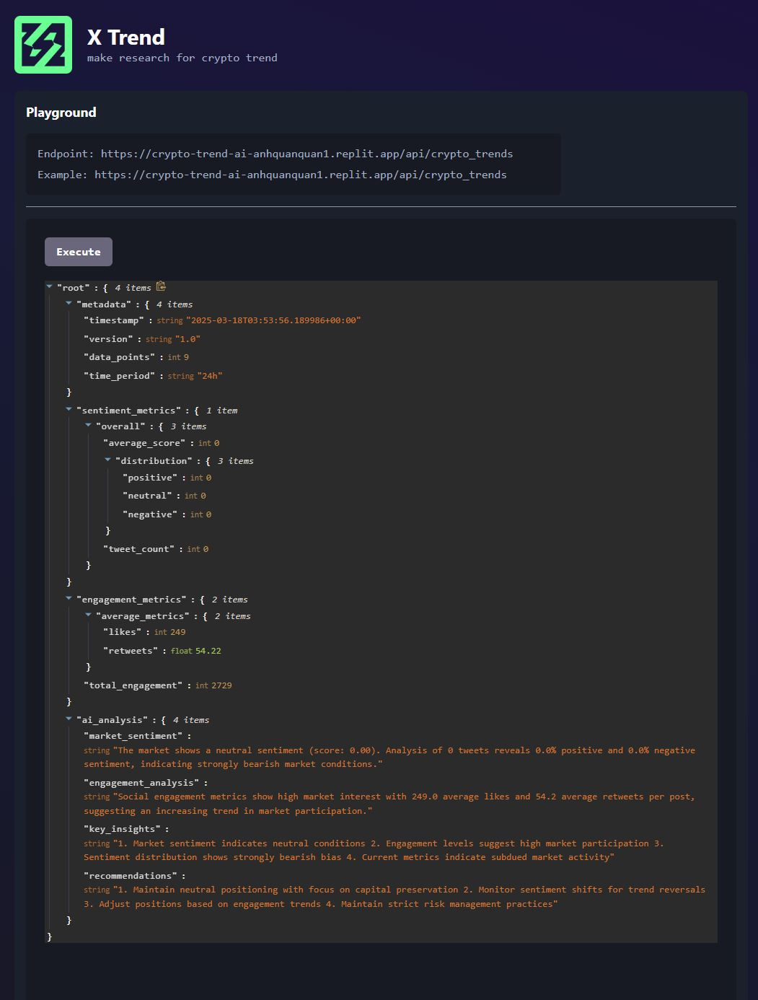
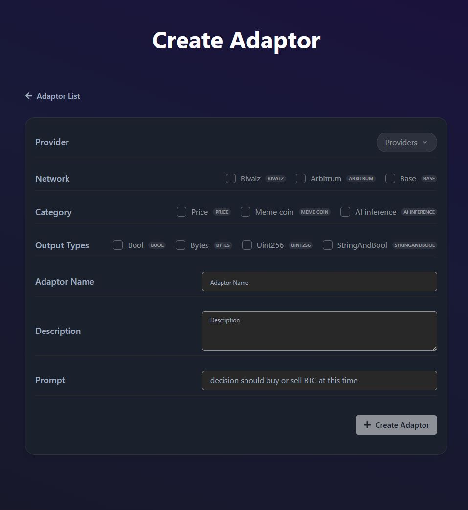
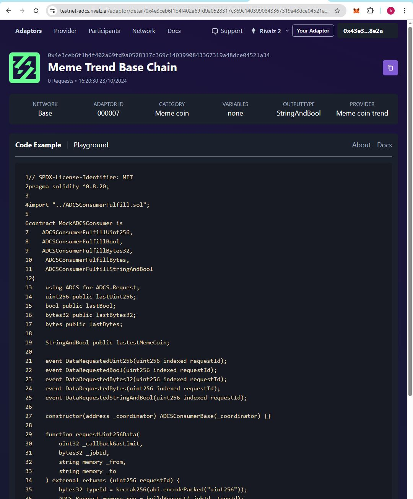
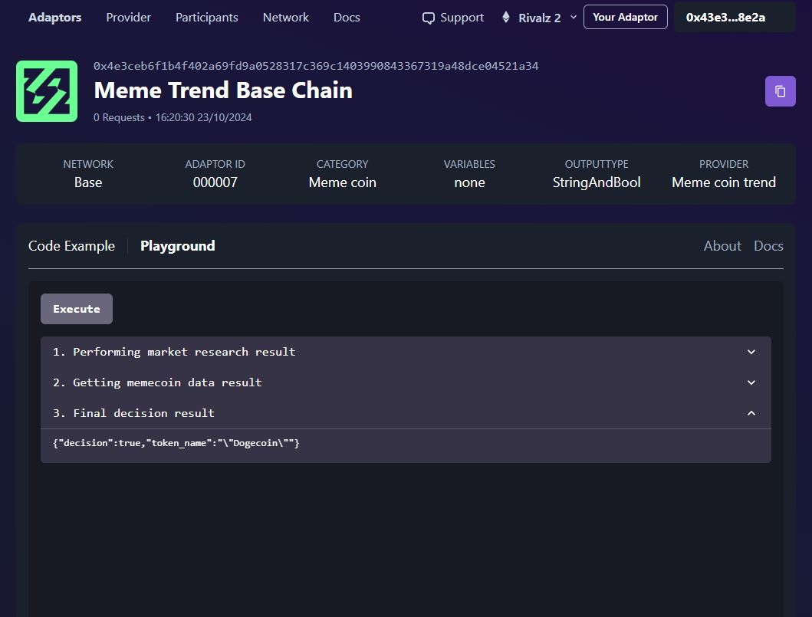

## Start building an Onchain AI Agent with ADCS

# Explore Available Inference Providers
You can find a list of available providers here [inference providers page](https://testnet-adcs.rivalz.ai/provider) 
For each provider, you can find the following information:
- Provider Name
- Provider Description
- Provider API Endpoint
- Provider API Documentation
- Test execution result

Here's an example of the X Trend provider that offers crypto market trend analysis:


To learn more about providers, please vist [here]

# Create an Adapter with your selected providers OR using predefined adapters
To create you own adapter, you can follow the steps below:
- Connect your wallet to the ADCS platform
- Click on the "Your Adapter" button
- Fill in the required fields:
  - Select your Provider
  - Choose Network (Rivalz, Arbitrum, or Base)
  - Select Category (Price, Meme coin, or AI inference)
  - Choose Output Types (Bool, Bytes, Uint256, or StringAndBool)
  - Enter Adapter Name and Description
  - Specify your Prompt

Here's the adapter creation interface:


- click on the "Create Adaptor" button

To explore predifined adapters, please visit [here](https://testnet-adcs.rivalz.ai/)
You can see specific details of each adapter and test the execution result.

Here's an example of a predefined adapter for Meme Trend analysis on Base Chain:



The example shows:
- Adapter ID and Network information
- Category and Output Type
- Provider details
- Code example for implementation
- Playground for testing

You can test the adapter directly in the playground to see how it processes data and returns results:



The playground allows you to:
- Execute test requests
- View the step-by-step processing results
- See the final decision output
- Verify the adapter's functionality before integration

# ⚠️ Important: Understanding Adapter Output Formats

Before integrating any adapter into your smart contracts, it's crucial to understand its output format. This understanding is essential for successful integration and preventing potential contract errors.

# Create your consumer smart contract.

- You need to inherit you consumer contract from our list of contracts based on you specific usecase. You can find the list of contracts [here]
- Some core function of the smart contract you need to implement are:

```
function requestBytes32Data(
    uint32 _callbackGasLimit,
    bytes32 _jobId,
    string memory _from
        ) external returns (uint256 requestId) {
        ADCS.Request memory req = buildRequest(_jobId, keccak256(abi.encodePacked("bytes32")));
        req.add("from", _from);
    requestId = COORDINATOR.requestData(_callbackGasLimit, req);
    emit DataRequestedBytes32(requestId);
}
```
You need to specify the `_jobId`, adapter parameters and `_callbackGasLimit` for the request.

```
function fulfillDataRequest(uint256, bytes32 response) internal virtual override {
    lastBytes32 = response;
    /// You business logic here
}
```
You need to implement your business logic in the `fulfillDataRequest` function.

# Now you can deploy your contract and start requesting data from the ADCS platform.

# How to automate you contract execution with Gelato

You can automate your contract execution with Gelato Network. Please follow this docs:
https://docs.gelato.network/web3-services/web3-functions/quick-start/initiate-an-automated-transaction

