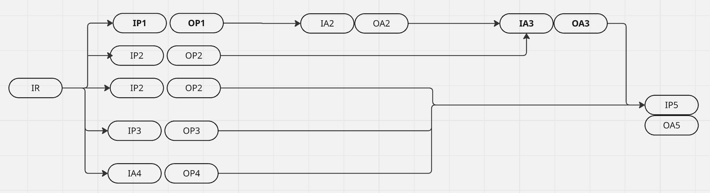

# IR Definition

- Initial request is a dynamic object that contain all inputs in the node definition.
- Adapter/Provider: have a static definition of the input and output schema.

```json
{
  "IR1": {
    "fields": {
      "value1": "string",
      "value2": "number"
    }
  },
  "IR2": {
    "fields": {
      "value1": "string",
      "value2": "number"
    }
  }
}
```

# Nodes definition

**1. single node**

```json
{
  "id": "P1",
  "type": "provider",
  "input": ["IR"],
  "output": "OP1"
}
```

- id: unique identifier for the provider/adapter
- type: provider/adapter
- input: list of input from IR or other nodes
- output: json schema of the output

**2. set of nodes**



**Inital request:**

```json
{
  "ParamSet1": {
    "fields": {
      "value1": "string",
      "value2": "number"
    }
  },
  "ParamSet2": {
    "fields": {
      "value1": "string",
      "value2": "boolean"
    }
  },
  "ParamSet3": {
    "fields": {
      "value1": "string"
    }
  },
  "ParamSet4": {
    "fields": {
      "value1": "string"
    }
  }
}
```

**Nodes definition:**

```json
[
  { "id": "P1", "type": "provider", "input": ["IR.ParamSet1"], "output": "OP1" },
  { "id": "P2", "type": "provider", "input": ["IR.ParamSet2"], "output": "OP2" },
  { "id": "P3", "type": "provider", "input": ["IR.ParamSet3"], "output": "OP3" },
  { "id": "A4", "type": "adapter", "input": ["IR.ParamSet4"], "output": "OA4" },
  { "id": "A2", "type": "adapter", "input": ["OP1"], "output": "OA2" },
  { "id": "A3", "type": "adapter", "input": ["OA2", "OP2"], "output": "OA3" },
  { "id": "P5", "type": "provider", "input": ["OP2", "OP3", "OA3", "OA4"], "output": "OA5" }
];

```

- IR: Initial Request
- OP: Output of the provider
- OA: Output of the adapter

**Process order:**

- P1 with input value from IR.ParamSet1 -> OP1
- P2 with input value from IR.ParamSet2 -> OP2
- P3 with input value from IR.ParamSet3 -> OP3
- A4 with input value from IR.ParamSet4 -> OA4
- A2 with input value from OP1 -> OA2
- A3 with input value from OA2 and OP2 -> OA3
- P5 with input value from OP2, OP3, OA3, OA4 -> OP5

**Note**

- The set of nodes will process in sequence, and the output of each node will be used as input for the next node.
- The output of the last node will be the output of the set of nodes.
- If 1 node not return any value, the set of nodes will be break and return an empty object.
