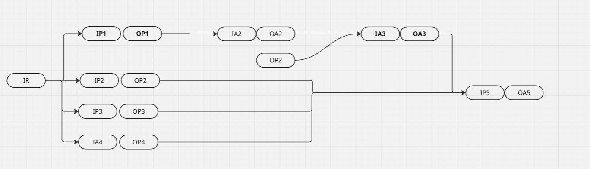

# I. Introduction

- One adapter can be use 1 or more providers/ adapters to get data from different sources.
- The data from different sources will be merged into one data and send to the destination(other providers/ adapters).
- The destination will be the next adapter or the final destination.
- Return the final output.

# II. Multiple Inputs

Each provider/adapter can have input parameters or not. And the input parameters need to be defined as json entity. All entities will be merged into one json entity called "initial request".

## Initial Request

### Step entity

- The step entity is a json entity that contains the data of the step.
  The basic structure of the step entity is:

```json
{
  "name": "name",
  "description": "description",
  "type": "provider/adapter",
  "providerId": "providerId",
  "input": { "value1": "value1" },
  "output": { "value2": "value2" }
}
```

- name: the name of the flow
- description: the description of the flow
- type: the type of the source data(provider/adapter)
- providerId: the id of the provider/adapter
- input: the input of the provider/adapter. It is a json entity
- output: the output of the provider/adapter. It is a json entity

### flow entity

- The flow entity is a json entity that contains the data of the flow.
- It can combine of multiple step entities.
- The input of the step is the output of the previous step.
- The output of the step is the input of the next step.
- The last one MUST be a core provider(AI LLM)

The basic structure of the flow entity is:

```json
{
  "name": "name",
  "description": "description",
  "type": "flow",
  "steps": [step1, step2, step3]
}
```

### Initial Request entity

- The initial request entity is a json entity that contains the data of the initial request.
- It can combine of multiple flow entities.
- The input of the flow is the output of the previous flow.
- The output of the flow is the input of the next flow.
- The last one MUST be a core provider(AI LLM)
- The output of the last flow is the output of the initial request.

The basic structure of the initial request entity is:

```json
{
  "name": "name",
  "description": "description",
  "type": "initialRequest",
  "flows": [flow1, flow2, flow3]
}
```

## Example

1. Flow with single step

Flow 1

```json
{
  "name": "flow1",
  "description": "get the price of the coin",
  "type": "flow",
  "steps": [
    {
      "name": "getPrice",
      "description": "get the price of the coin",
      "type": "provider",
      "providerId": "123",
      "input": { "coinName": "BTC", "currency": "USD" },
      "output": { "price": 10000 }
    }
  ]
}
```

2. Flow with multiple steps

Flow 2

```json
{
  "name": "flow2",
  "description": "get the price of the coin and analyze the price",
  "type": "flow",
  "steps": [
    {
      "name": "getPrice",
      "description": "get the price of the coin",
      "type": "provider",
      "providerId": "123",
      "input": { "coinName": "BTC", "currency": "USD" },
      "output": { "price": 10000 }
    },
    {
      "name": "analyst",
      "description": "analyze the price of the coin",
      "type": "provider",
      "456": {
        "input": {
          "coinName": "BTC",
          "price": 10000,
          "AI prompt": "analyze the price of the coin, the output is a json format with the key is 'analysis'"
        },
        "output": { "analysis": "good" }
      }
    }
  ]
}
```

3. Initial Request with multiple flows

Initial Request

```json
{
  "name": "initialRequest",
  "description": "get the price of the coin and analyze the price",
  "type": "initialRequest",
  "flows": [
    {
      "name": "flow1",
      "description": "get the price of the coin",
      "type": "flow",
      "steps": [
        {
          "name": "getPrice",
          "description": "get the price of the coin",
          "type": "provider",
          "providerId": "123",
          "input": { "coinName": "BTC", "currency": "USD" },
          "output": { "price": 10000 }
        },
        {
          "name": "analyst",
          "description": "analyze the price of the coin",
          "type": "provider",
          "456": {
            "input": {
              "coinName": "BTC",
              "price": 10000,
              "AI prompt": "analyze the price of the coin, the output is a json format with the key is 'analysis'"
            },
            "output": { "coinName": "BTC", "analysis": "good" }
          }
        }
      ]
    },
    {
      "name": "flow 2",
      "description": "analyze the market cap of the coin",
      "type": "flow",
      "steps": [
        {
          "name": "get data",
          "description": "get the data of the coin",
          "type": "provider",
          "providerId": "789",
          "input": {
            "coinName": "BTC",
            "prompt": "get the data of the coin"
          },
          "output": { "coinName": "BTC", "data": "data" }
        }
      ]
    },
    {
      "name": "Trade coin",
      "description": "trade the coin",
      "type": "flow",
      "steps": [
        {
          "name": "tradeCoin",
          "description": "trade the coin",
          "type": "provider",
          "providerId": "789",
          "input": {
            "coinName": "BTC",
            "price": "out put of flow 1",
            "data": "out put of flow 2",
            "prompt": "Make a decision to buy or sell the coin based on the data. the output is a json format with the key is 'decision'"
          },
          "output": { "coinName": "BTC", "decision": "buy" }
        }
      ]
    }
  ]
}
```
